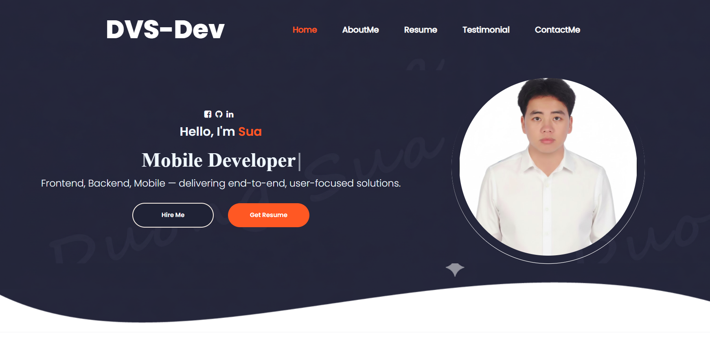
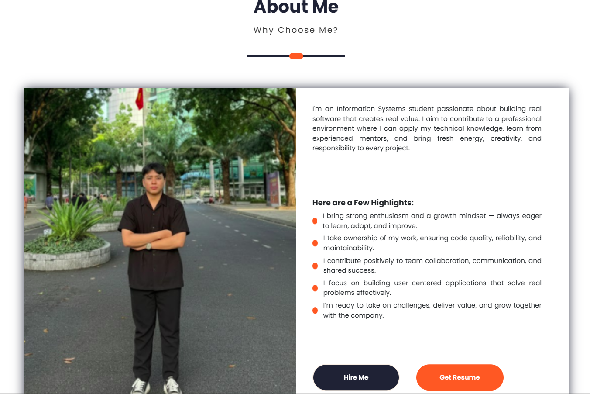
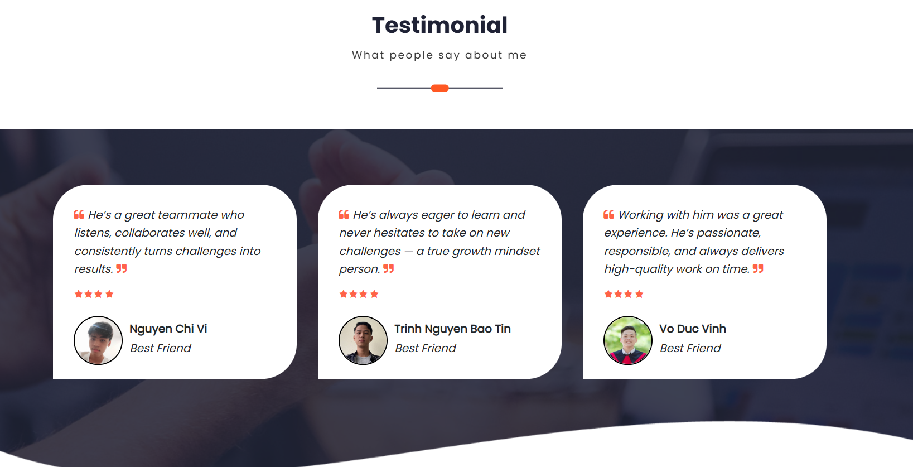
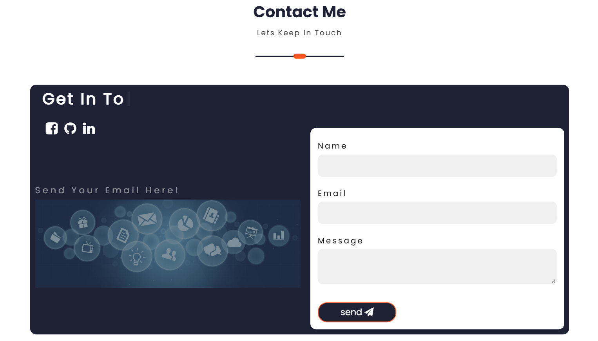

# fe-personal-website

This is the **frontend** of my personal portfolio website — built using **ReactJS**.  
The website showcases my profile, resume, skills, and contact information through a clean, modern, and responsive design.


## How to Run

Follow these steps to run the project locally:

### 1 Clone the repository
```bash
git clone https://github.com/DuongVanSua/fe-personal-website.git
cd fe-personal-website
```

### 2️ Install dependencies
```bash
npm install
```

### 3️ Start the development server
```bash
npm start
```

Then open your browser at [http://localhost:3000](http://localhost:3000)

The app will automatically reload whenever you make code changes.

## Build for Production

To create an optimized production build:
```bash
npm run build
```

This will generate a **`build/`** folder containing the optimized static files ready for deployment.  
You can host the build on **Netlify**, **Vercel**, or serve it via your Node.js backend.


## Technologies Used

| Category | Tools & Libraries |
|-----------|------------------|
| **Framework** | ReactJS (Create React App) |
| **Styling** | CSS3, Flexbox, Custom Responsive Layout |
| **UI Effects** | React Simple Typewriter, React Toastify |
| **Icons** | Font Awesome |
| **HTTP Requests** | Axios |
| **Email Integration** | Express + Nodemailer (Backend) |
| **Version Control** | Git & GitHub |


## Demo (UI Preview)

### Home


### AboutMe


### Resume


### Testimonial



### Contact



## Deployment

You can deploy the app in several ways:

- **Netlify** → Drag and drop the `build` folder  
- **Vercel** → Connect your GitHub repository for automatic deployment  
- **Render / Heroku** → Combine with your backend server

For more details, check out the official [Create React App Deployment Guide](https://facebook.github.io/create-react-app/docs/deployment).


## Tips

- Always run `npm run build` before deploying to production.  
- Use `.env` files for environment variables (like API URLs).  
- Keep dependencies updated for better performance and security.  


## Author

**Duong Van Sua**  
📧 [duongsua.work@gmail.com](mailto:duongsua.work@gmail.com)  
🌐 [LinkedIn](https://www.linkedin.com/in/sua-duong-270444339/) | [GitHub](https://github.com/DuongVanSua)

